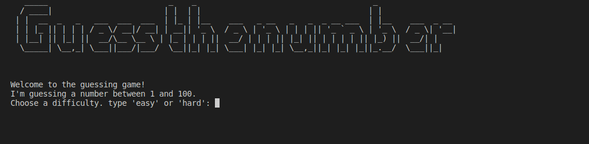

# Day12

## Lessons learned today

- Local scope and Global scope
```
NAME = "King"

def myfunc():
  x = 300
  print(x)

myfunc()

def printName():
    print(NAME)

printName()
```


## Project to solidify material learned: 


### Guess_the_Number
> The user is asked to guess a number between 1 - 100 and if the guess is correct the user wins the game if the guess is incorrect the user makes another guess until the lives have run out

#### Preview:



## How to run this on your device

- Clone this repository
```
git clone https://github.com/kingdreamerr/Day12_Guess_Number.git
```
- cd into the repo
```
cd Day12_Guess_Number
```

- Paste the following in the terminal 
```
python3 main.py
```